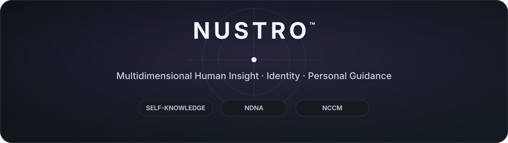

  

**A foundation for deeper self-knowledge, persistent identity understanding, and context-aware personal guidance.**

 

## How deeply can a person actually know themselves?

We live through our own minds, emotions, behavioral patterns, decisions, strengths, vulnerabilities, relationships, and unrealized capacities — yet we rarely hold a coherent view of all of them at once.

> **How do I think? How do I decide? What shapes my emotions and behavior? How do others experience me? What patterns keep repeating — and where are my unrealized capacities?**

**Nustro was created to build a deeper, more coherent, multidimensional understanding of the individual** — and to make that understanding usable for reflection, challenge analysis, personal decision-making, and long-term development.

 

## The Nustro Idea

Human beings are multidimensional. Understanding them from a single perspective is inherently limited.

Across history, scientific, interpretive, symbolic, traditional, and modern systems have approached different aspects of the individual from different angles. Nustro brings multiple perspectives into one system to form a broader, more integrated view of the person.

The value is not in any single perspective by itself.

**The value is in the coherent identity picture Nustro builds around one individual.**

 

## Three Core Outcomes

<table>
<tr>
<td width="33%" valign="top">

### Multidimensional Insight

A broader view of the individual across personality, cognition, emotion, behavior, decisions, relationships, capacities, tensions, and development.

</td>
<td width="33%" valign="top">

### NDNA™

A persistent identity reference designed to carry Nustro's multidimensional understanding of an individual across the ecosystem.

</td>
<td width="33%" valign="top">

### NCCM™

An identity-anchored coaching model that uses persistent knowledge of the person together with present reality and the current challenge.

</td>
</tr>
</table>

 

# NDNA™

### Nustro DNA

NDNA is Nustro's proprietary identity reference: a persistent representation designed to carry a coherent, multidimensional understanding of an individual.

Instead of allowing personal understanding to remain fragmented across conversations, reports, or temporary interpretations, NDNA gives the Nustro ecosystem a shared identity reference that can persist over time.

> **One person. One persistent identity reference. Multiple experiences built around it.**

NDNA turns self-understanding from a temporary output into a reusable identity asset — one that can support multiple Nustro experiences without requiring the person's identity to be reconstructed from scratch each time.

Its generation methods, internal structure, analytical engines, mappings, and processing logic remain proprietary.

 

## From Self-Knowledge to Self-Understanding

Structured knowledge becomes valuable when a person can actually see themselves through it.

Nustro translates identity-level understanding into a human-readable, multidimensional reflection that can help reveal relationships between aspects of the self that are often experienced separately.

<kbd>Identity</kbd>&nbsp;
<kbd>Mind</kbd>&nbsp;
<kbd>Emotion</kbd>&nbsp;
<kbd>Decision</kbd>&nbsp;
<kbd>Behavior</kbd>&nbsp;
<kbd>Relationships</kbd>&nbsp;
<kbd>Strengths</kbd>&nbsp;
<kbd>Tensions</kbd>&nbsp;
<kbd>Growth</kbd>

 

**The goal is to turn knowledge about the self into usable understanding.**

 

# NCCM™

### Nustro Cosmos Coaching Model

Self-knowledge becomes practical when it can enter real decisions, conflicts, transitions, and challenges.

Nustro developed **NCCM — Nustro Cosmos Coaching Model** as an identity-anchored coaching model built on top of Nustro's persistent understanding of the individual.

Coaching therefore does not have to begin from a blank page or rely only on what a person happens to express in the current conversation. The present challenge can be understood in relation to a deeper, already-established understanding of the person.

 

## Identity-Anchored, Context-Aware Coaching

NCCM keeps two fundamental questions in view:

> **Who is this person?**  
> **What is happening to this person now?**

Identity and current context are not the same thing.

Work, relationships, finances, energy, time, pressure, opportunity, and limitation can change. Those conditions matter — but they do not need to redefine the individual every time they change.

NCCM keeps persistent identity knowledge and current reality in view at the same time, allowing guidance to become more personal, contextual, and grounded.

 

## The NCCM Perspective

| Field | What it looks at |
|---|---|
| **Identity** | What does this challenge mean for this particular person? |
| **Reality** | What conditions, resources, and constraints are present now? |
| **Tension & Transformation** | Where is the core friction between the person and the current situation? |
| **Time** | What role does timing or the person's current phase play? |
| **Action & Feedback** | What practical movement can turn understanding into change? |

### Identity + Reality + Challenge → Personalized Guidance

NCCM is designed to understand the problem before prescribing movement.

**Self-knowledge is not the end of the process. It becomes an input to action.**

 

# What Nustro Enables

<table>
<tr>
<td width="50%" valign="top">

### Deeper Self-Knowledge

See different dimensions of the self as part of a more coherent whole.

</td>
<td width="50%" valign="top">

### Pattern Awareness

Recognize recurring patterns, capacities, tensions, and blind spots that may be difficult to see from inside everyday experience.

</td>
</tr>
<tr>
<td width="50%" valign="top">

### Personalized Reflection

Examine challenges in relation to the individual rather than through generic advice alone.

</td>
<td width="50%" valign="top">

### Context-Aware Guidance

Bring current reality into the process without losing continuity of identity.

</td>
</tr>
<tr>
<td width="50%" valign="top">

### Longitudinal Continuity

Preserve a stable identity reference across time instead of rebuilding personal understanding in every interaction.

</td>
<td width="50%" valign="top">

### Personal Development

Turn self-knowledge into a living resource for reflection, choice, growth, and deliberate movement.

</td>
</tr>
</table>

 

# From Knowledge to Action

### Self-Knowledge → Identity → Understanding → Guidance → Growth

Nustro connects self-understanding with how a person navigates real life.

Its value is not limited to a report or a single conversation.

> **It is a foundation for experiences that need to understand the individual over time.**

 

## Current Status

**Active Research & Development**

Nustro has evolved through multiple generations of identity modeling, personal analysis, narrative synthesis, and coaching operation.

Current work is focused on increasing product maturity and precision, strengthening NDNA as a persistent identity foundation, and expanding the range of experiences that can be built around long-term personal understanding.

 

<strong>Technology, Public Scope & Interpretation</strong>

 

### Technology-Independent by Design

Nustro is not defined by a specific AI model, agent architecture, programming language, or execution environment.

Technology may change how Nustro is implemented and experienced. The underlying product identity remains centered on its model of personal understanding, NDNA, and the experiences built around that identity reference.

AI can be a powerful execution and interaction layer within Nustro, but it is not the definition of Nustro itself.

### Public Scope

This repository presents the public product layer of Nustro: its vision, human value, NDNA at a conceptual level, NCCM, and selected product-level architecture.

NDNA generation methods, analytical engines, exact source composition, internal structures, algorithms, mappings, processing logic, and proprietary protocols remain private.

### Scope & Interpretation

Nustro is a **personal insight and coaching system**.

Its knowledge sources span different traditions and modes of interpretation. Some are scientific or empirical in nature; others are symbolic, interpretive, traditional, or commonly described as pseudoscientific.

Nustro is not presented as a medical, psychiatric, or clinical psychological diagnostic system.

Its value is defined by how it brings multiple perspectives together into a coherent, usable experience of personal understanding and guidance.

 

---

### Designed & Developed by [Ali Alavi](https://github.com/alaviarts)

**Product & Systems Architect**

 

*Nustro™ · NDNA™ · NCCM™*

**© 2026 Ali Alavi. All rights reserved.**

[Proprietary License](./LICENSE.md) · [IP Notice](./NOTICE.md)

 

*Know yourself deeply enough to move deliberately.*

